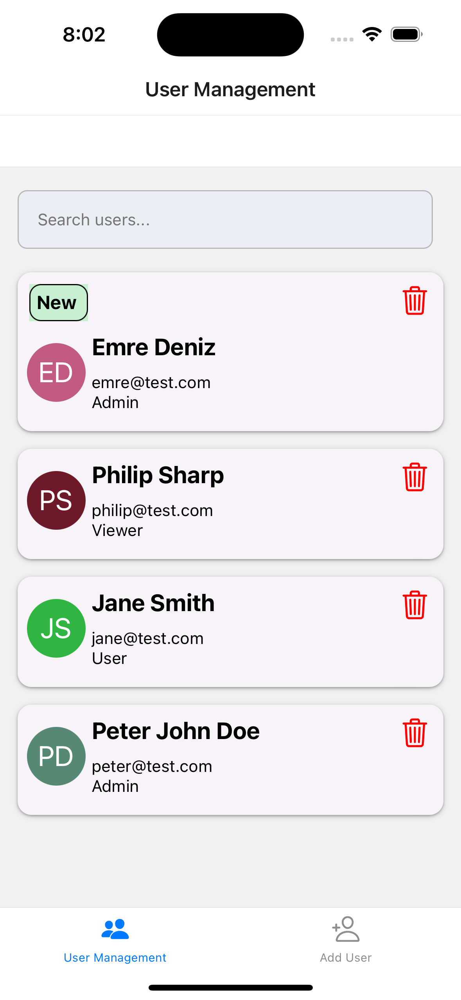
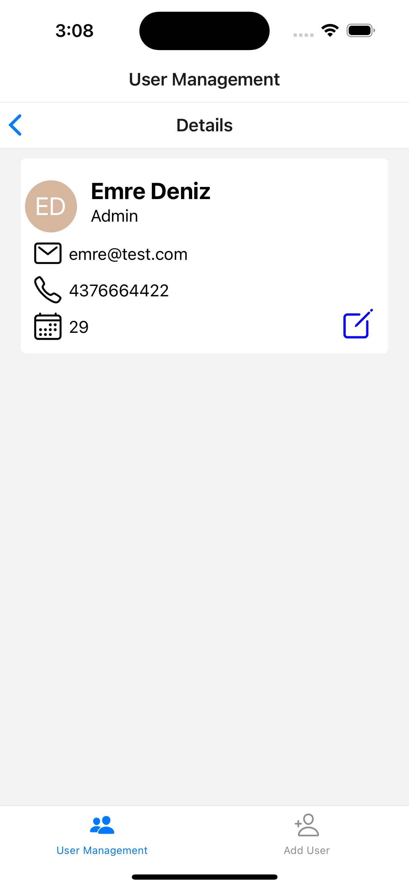
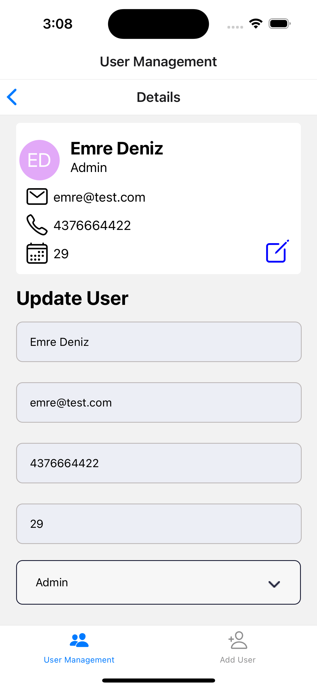
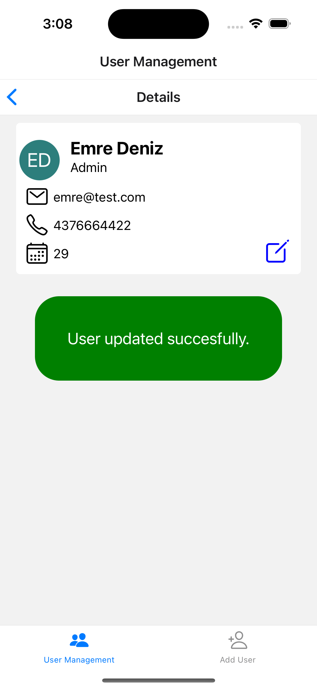
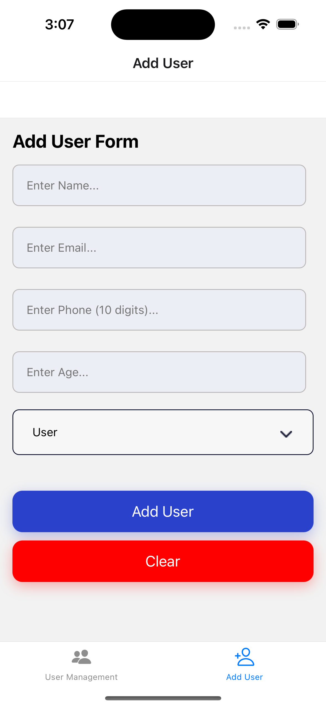
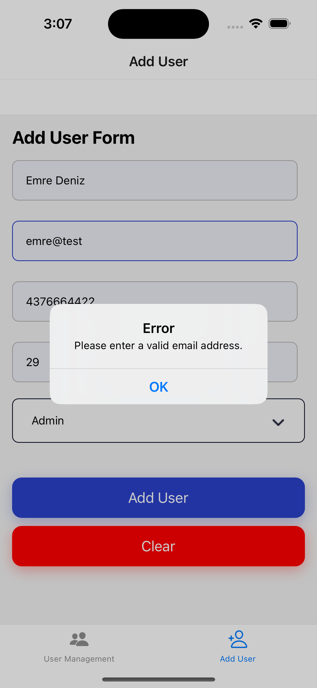
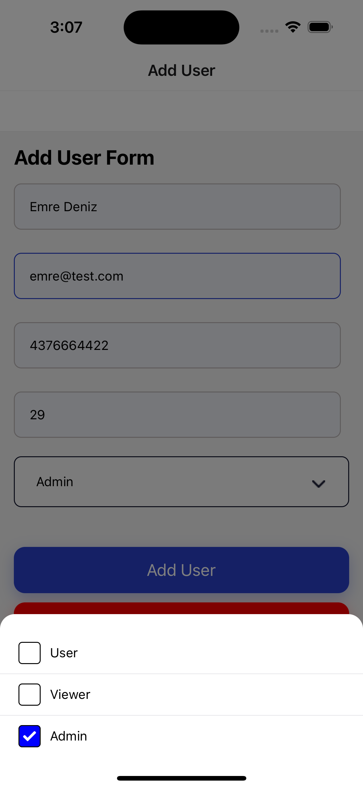
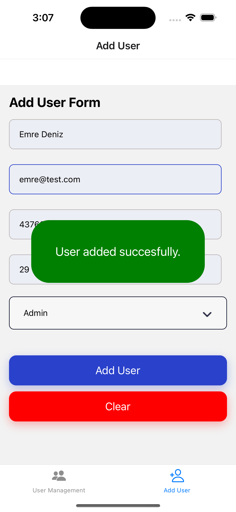
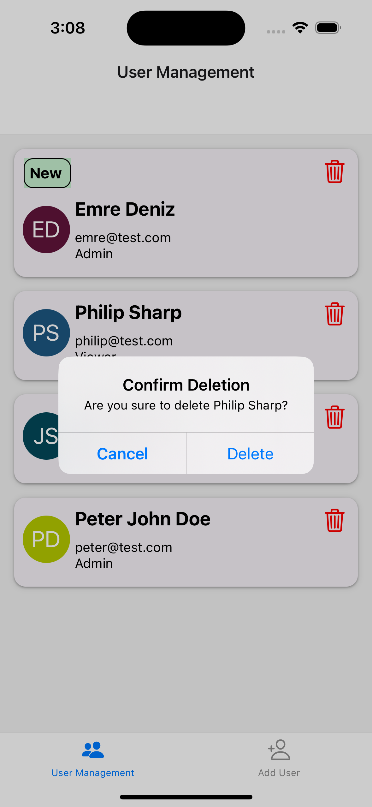
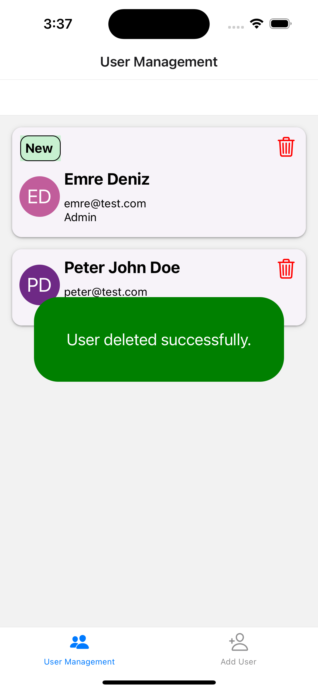

# React-Native-User-Management-App
React Native User Management App using TypeScript, Redux and REST API (Node.js and Express).

### HOW TO RUN:
```console
// Run backend API
cd backend
npm install
node app.js // keep terminal open

// Run app
Run an iOS or Android simulator
Open new terminal

npm install
npx expo start
    press i (for iOS)

// Note: Android simulator gives network error because Android prevents non-SSL API requests.
         Deploying API to a platform with SSL could be the solution in the future.
```

### FEATURES:
1. The app uses REST API server
2. List all users
3. Search users
4. Add a new user
5. View user details
6. Update user information
7. Delete a user
8. Tag the most recent user (using Redux store)

### SCREENSHOTS:
<kbd></kbd>    <kbd></kbd>    <kbd></kbd>    <kbd></kbd>


<kbd></kbd>    <kbd></kbd>    <kbd></kbd>    <kbd></kbd>


<kbd></kbd>    <kbd></kbd>
