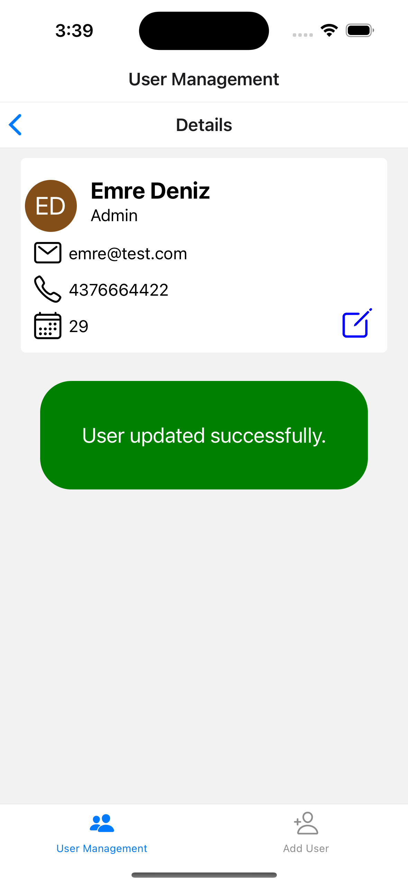
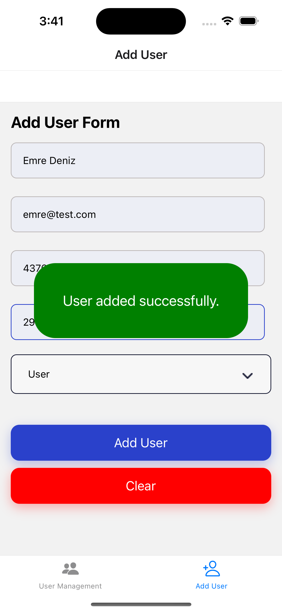

# React-Native-User-Management-App
React Native User Management App using TypeScript, Redux and REST API.

### HOW TO RUN:
```console
// Run backend API using Node.js and Express.js
cd backend
npm install
node app.js // keep terminal open

// Run app
Run iOS or Android simulator
npm install
npx expo start
  press i (for iOS)
```

### FEATURES:
1. The app uses REST API server
2. List all users
3. Add a new user
4. View user details
5. Update user information
6. Delete a user
7. Tag the most recent user (using Redux store)

### SCREENSHOTS:
<kbd></kbd>    <kbd></kbd>    <kbd></kbd>    <kbd></kbd>


<kbd></kbd>    <kbd></kbd>    <kbd></kbd>    <kbd></kbd>


<kbd></kbd>    <kbd></kbd>
